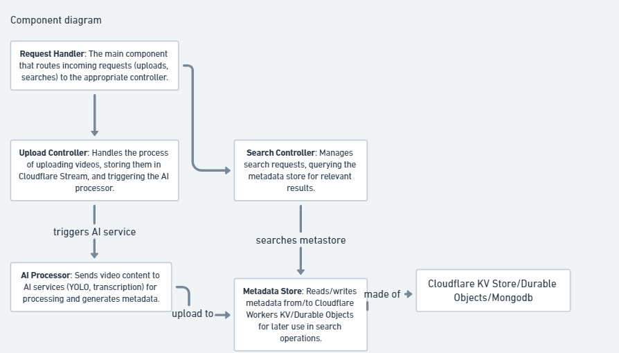
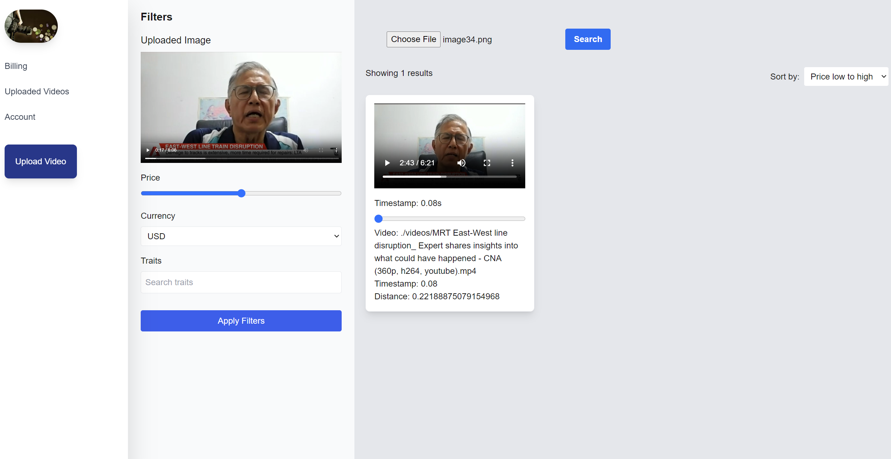

# ai-video-search

### Overall Architecture of AI Powered Video Search Engine

Simply upload images and search the existing database for videos with possible image references. 



### Visualisations from site
1. Search Page


## Installation Requirements:
- Docker 
- Go

## How to start up the system:
1. Create a virtual environment with command and activate environment:
```
python3 -m venv env
.\env\Scripts\activate 
```

2. Install python packages with command:
```
pip install -r requirements.txt
```

3. Start feature extraction service (with multi gpu support) by running command:
```
python3 .\feature_extraction_service.py
```

4. Start feature search api with command:
```
python3 .\feature_search_api.py
```
5. Start redis service on docker:
```
docker pull redis
docker run --name redis-server -p 6379:6379 -d redis
```

6. Start index writer that subscribes to redis queue and updates features given by feature extraction service with command:
```
python3 .\indexUpdater.py
```

7. Start golang api for backend services with command:
```
cd golangapi
go run main.go
```

7. 


## To Dos:
- [x] Login page
- [x] Search results with image
- [x] Upload video functionality 
- [ ] Enable stripe payment for users with more than 5 uploads per day


References:
- CBIR problem
